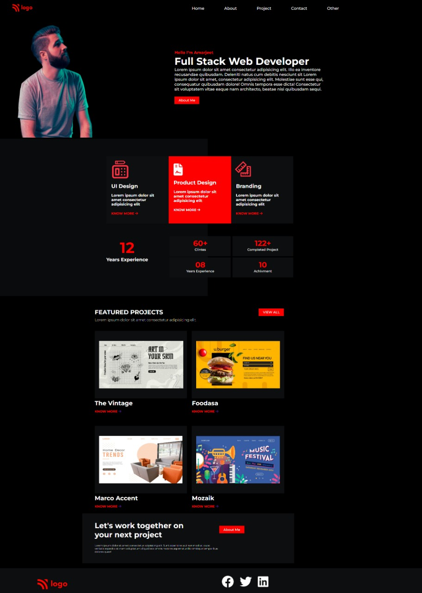

# Project-15-  Web Landing Template.
 ## Hey there ,  I am Amarjeet Kumar 
 I have build a template of HTML and CSS.
 
 
 
 

 My Live Deployed Website Link :- [Click here !](https://project-15-web-page-template.netlify.app/)

 
 

 ## What I have learned in this project .
 - In this project i have learned alout about image adjustment on web page and how I move my image on web page .
 - Most important think which I learned through this project is , how i make any text like only outline is showing.
 - Also in this project I learned about color combination by the help of linear ingredient.
